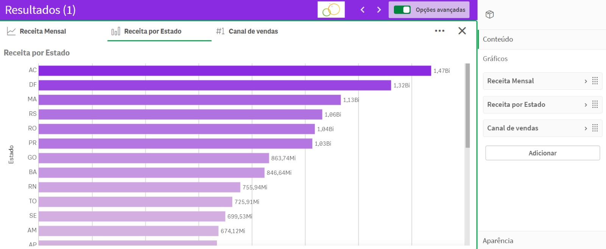

# Criação de Dashboard em Qlik Sense

## Entendimento do Problema

Este dashboard ajuda a empresa a entender melhor os seus indicadores financeiros, utilizando o Qlik Sense para construir uma plataforma abrangente de análise e visualização de dados. O objetivo é criar um dashboard que facilite a visualização das informações financeiras e acompanhe métricas essenciais como receita, ticket médio, lucro e vendas.

A construção deste dashboard começa com a coleta de dados financeiros detalhados, que são então organizados e carregados no Qlik Sense. Uma vez no Qlik Sense, esses dados são transformados em visualizações dinâmicas e interativas, permitindo uma análise aprofundada e em tempo real das finanças da empresa.

O dashboard inclui várias seções e gráficos que destacam diferentes aspectos das operações financeiras:

   

   

### Passos Seguidos

1. **Carregar dados no Qlik Sense Desktop**: Integração com arquivos excel.

2. **Preparação dos Dados no Desktop**: As colunas que não "Hórario", "Task ID" e "Identificação" foram desflegada pois não tinham uso em nossos visuais

3. **KPI's**:
   
Criação de KPI para:
- Receita
- Ticket Médio
- Lucro
- Vendas

Além dessas métricas principais, o dashboard pode incluir filtros interativos que permitem aos usuários segmentar os dados por período, região, produto ou qualquer outra dimensão relevante. Isso proporciona uma visão personalizada e detalhada das finanças, adaptada às necessidades de diferentes usuários dentro da empresa.

4. **Multiplos Visuais**

   

      

4. **Graficos Gerais**
   
   

   
    
    MÉDIA DE DIAS DE ENTREGA = 
        
        avg({<Ano_Ordem={"$(=MAX(Ano_Ordem))"}>} Dias_Entrega)

     Comprimento de Meta = 
        
       if((avg({<Ano_Ordem={"$(=MAX(Ano_Ordem))"}>} Dias_Entrega)/21)>1,1-((avg({<Ano_Ordem={"$(=MAX(Ano_Ordem))"}>} Dias_Entrega)/21)-1),1)

5. **MAPA**: Configuração do gráfico de mapa

   

   
   
## Resultado Final

O dashboard desenvolvido oferece uma visão completa dos indicadores financeiros da empresa, permitindo um monitoramento eficaz das métricas essenciais e facilitando a tomada de decisões estratégicas. Utilizando o Qlik Sense, a empresa pode acompanhar em tempo real a receita, o ticket médio, o lucro e as vendas, promovendo uma gestão financeira mais eficiente e proativa.
